# **Magic Mirror**

  
# Contenido

**[Ensamblaje](#ensamblaje)**
- [Materiales](#materiales)
- [Planos](#planos)
- [Corte y armado](#corte-y-armado)

**[Fase 1: Que funcione](#fase-1-que-funcione)**
- [Distribución de Linux](#distribución-de-linux)
- [Instalación del sistema operativo](#instalación-del-sistema-operativo)
- [Configuración inicial](#configuración-inicial)
- [Descargar Magic Mirror](#descargar-magic-mirror)
- [Instalación de Node.js](#instalación-de-nodejs)
- [Clonar repositorio](#clonar-repositorio)
- [Primer arranque](#primer-arranque)
- [Solución de errores](#solución-de-errores)

**[Fase 2: Configuración, módulos y sensores](#fase-2-configuración-modulos-y-sensores)**
- [Configurar](#configurar)
  - [Orientación de pantalla](#orientación-de-pantalla)
  - [Autostart](#autostart)
  - [Módulos existentes](#módulos-existentes)
- [Agregar sensores](#agregar-sensores)
  - [Sensor de proximidad](#sensor-de-proximidad)
  - [Humedad y temperatura](#humedad-y-temperatura)
- [Agregar módulos](#agregar-módulos)
  - [Spotify](#spotify)

**[Fase 3: Página web](#fase-3-página-web)**

**[Fase X: Espejo de Shrek](#fase-x-espejo-de-shrek)**

**[Fase X: IoT](#fase-x-iot)**

**[Fase X: Cámara](#fase-x-cámara)**

# Ensamblaje

**Materiales**
raspberry $
sensor de movimiento $
sensor de temperatura y humedad $
espejo $631
adaptador $
monitor $
madera de pino $
barniz $
tornillos 

**herramientas que utilizamos**

**Planos**
https://www.tinkercad.com/things/acXXvp0teFw/edit?returnTo=%2Fdashboard

**Pasos**
Como cortamos la madera y asi 
gran tuto https://michaelteeuw.nl/series/MagicMirror
 
  

# Fase 1: Que funcione

## Distribucion de linux

Antes de este proyecto habia trabajado con Raspbian OS de 64 bits Debian 12 bookworm, y el raspberry funcionaba lento por lo que decidimos buscar otras opciones.
Buscamos otras alternativas:

 - La primera opción era DietPi, lo probe en una maquina virtual en mi computadora y me di cuenta que no era compatible con la biblioteca Electron.
  - Probe Raspberry Pi OS de 32 bits pero igual era incompatible con una biblioteca de node.js.
 Asi que para no complicarnos la vida usaremos Rasperry Pi OS de 64 bits.

Para usarlo lo primero que hice es instalar Raspberry pi imager

Seleccione el modelo de mi raspberry, el sistema operativo, el microsd de almacenamiento, nombre del dispositivo, zona horaria, nombre de usuario, contraseña, red, ME PERMITIO ACTIVAR EL SSH, confirme mis elecciones y empezo a escribir.

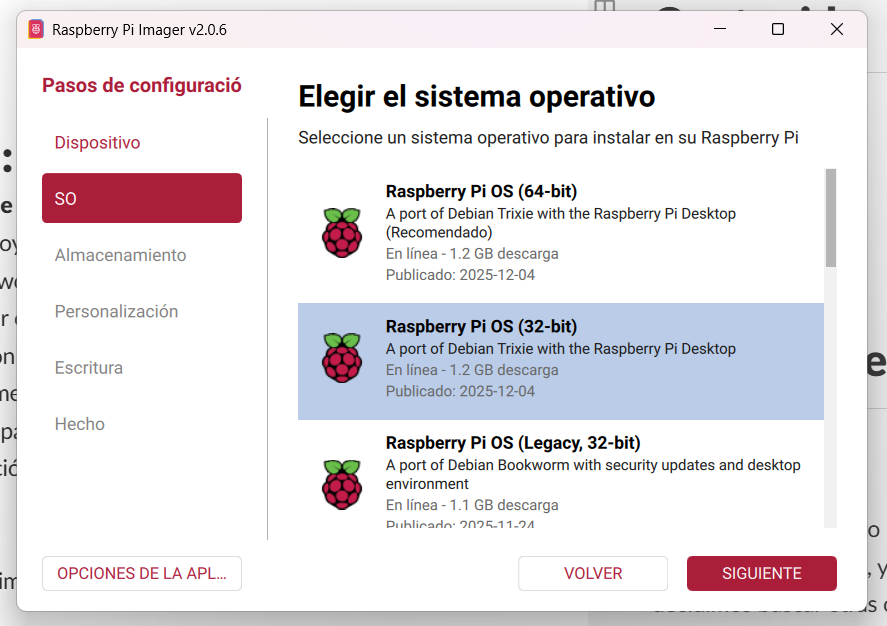
  

Puse la microsd en el raspberry y espere a que iniciara y terminara con las ultimas configuraciones

Configure el internet

Por ultimo habilite el vnc para poder controlarlo desde la laptop

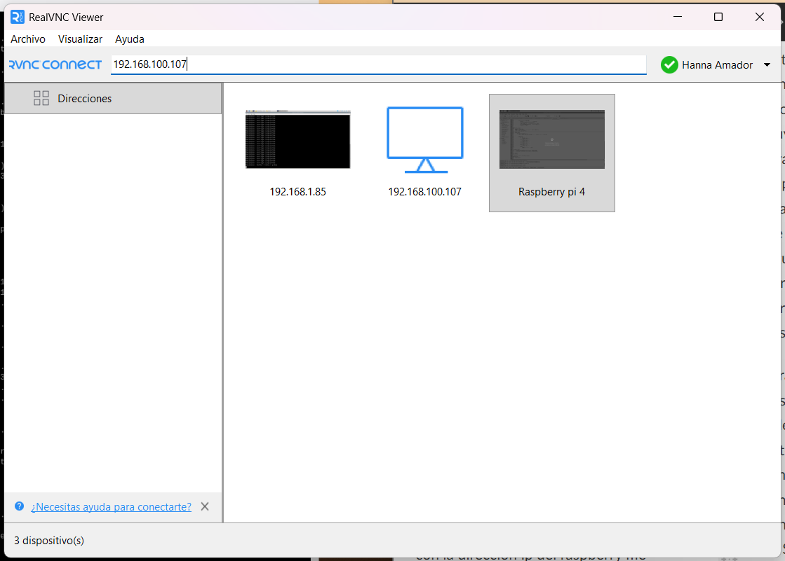
  

Instale el RealVNC Vierwer en la laptop y con la direccion ip del raspberry me conecte

  

Busco actualizaciones

`sudo apt update`

`sudo apt upgrade -y`

  

## Descargar Magic Mirror

Para esto voy a seguir los pasos que dice la pagina oficial https://docs.magicmirror.builders/getting-started/installation.html

  

Dice que el primer paso es **descargar e instalar node.js**

Para eso sigo las instrucciones del repo de github de node.js

https://github.com/nodesource/distributions/blob/master/DEV_README.md#installation-instructions

  

para ver si curl esta instalado hago

`curl --version`

si esta instalado

  

Este comando *descarga un script que luego se usa para instalar Node.js (v22) desde el repositorio oficial de NodeSource.

`curl -fsSL https://deb.nodesource.com/setup_22.x -o nodesource_setup.sh`

  

me voy a matar dice que node.js no es compatible con 32 bits

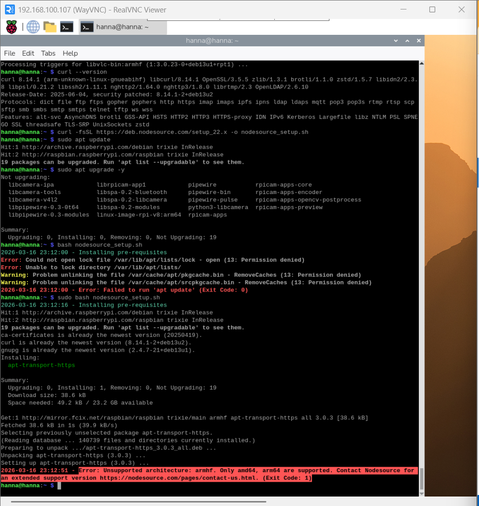

creo que voy a tener que volver al raspberry pi os de 64 bits

  
  

corro el setup script

`sudo bash nodesource_setup.sh`

  

installo node.js

`sudo apt install -y nodejs`

  

compruebo la instalacion

`node -v`

  

El siguiente paso es ver si esta instalado **git**

para ver si esta instalado solo escribo

`git`

si esta instalado 

  

El paso 3 seria **clonar el repositorio del magic mirror**

`git clone https://github.com/MagicMirrorOrg/MagicMirror.git`

Entro al repositorio 
`cd MagicMirror`

instalo la aplicacion
`node --run install-mm`

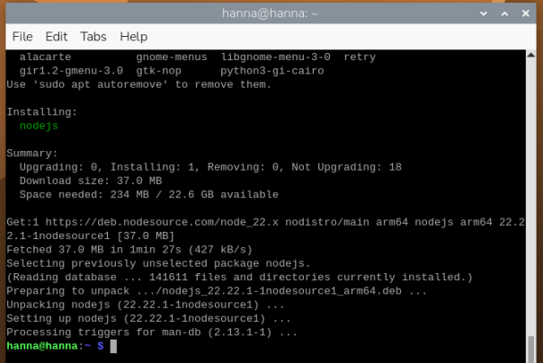

inicio la aplicacion 
`node --run start`

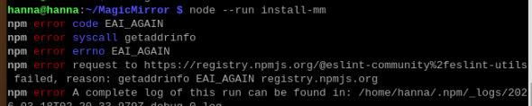

salieron muchos errores no se si eso esta bien, a lo mejor tiene que ver con que se me fue el internet a media descarga nose

corro eso para que se instale todo al 100

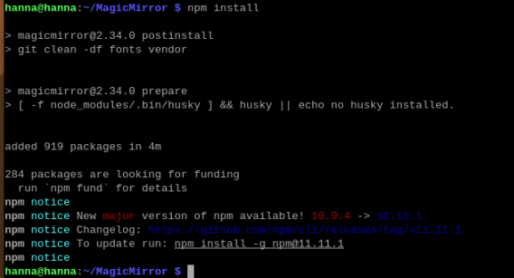

lo voy a correr a ver si esta todo bien 
lo intento correr con 
`node --run start`

pero me da un error

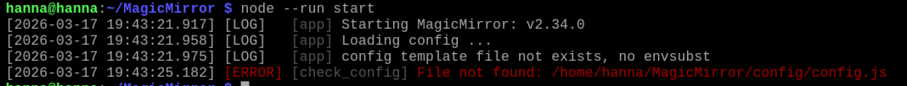

creo que me salte este paso jeje
copio el archivo de configuracion
`cp config/config.js.sample config/config.js`

ahora si lo corro 
`node --run start`

y ya funciono lestgoooo

# Fase 2: Configuración, modulos y sensores
## Configurar
**Cambiar orientación de pantalla**
Para cambiar la orientación de la pantalla en Raspberry Pi voy a maenu>preferences>control center
me pidio contraseña para abrirlo

y voy al apartado de screens

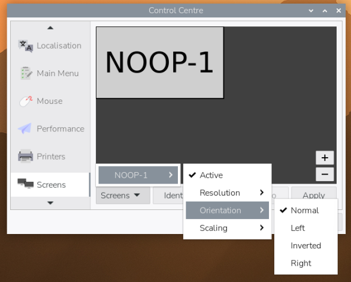

selecciono left

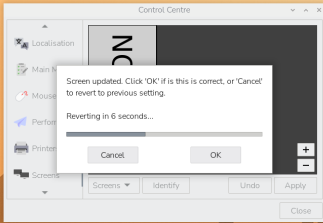

**Cambiar configuración**
en la terminal voy al directorio

`cd /MagicMirror/config/`

abro el archivo de config.js en thonny para modificarlo mas facil, al final copie todo y lo modifique en mi lap y ya despues nomas lo pegue en thonny porque era mas facil

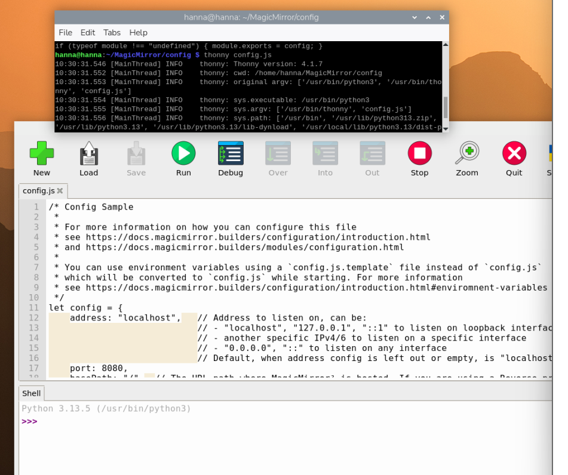

de la configuracion general, solo cambie el idioma y el timeFormat
`language: "spa", // cambio el idioma a español`

`	timeFormat: 12, // cambio el formato de horas de 24 a 12 `

https://docs.magicmirror.builders/configuration/introduction.html

**Autostart**
Para que se incie solo usaremos PM2, es un gestor de procesos avanzado para aplicaciones Node.js que garantiza que las aplicaciones estén siempre activas

abro la terminal y instalo PM2
`sudo npm install -g pm2`

para que siempre se inicie al encender la raspberry
`pm2 startup`

... luego

https://docs.magicmirror.builders/configuration/autostart.html

## Modulos
**Configurar modulos existentes**

para esto segui editando el archivo de conofig.js
ahora en la parte de modules, cambie algunas configuraciones para ver que hacian
https://docs.magicmirror.builders/modules/configuration.html
toda la info esta en esta pagina 

cuando llegue a la parte del **calendario**, queria que se viera mi calendario no el gringo que estaba ahi, en el mismo documento decia que podia poner cualquier
calandario en iCal, entonces fui a mi calendario de google

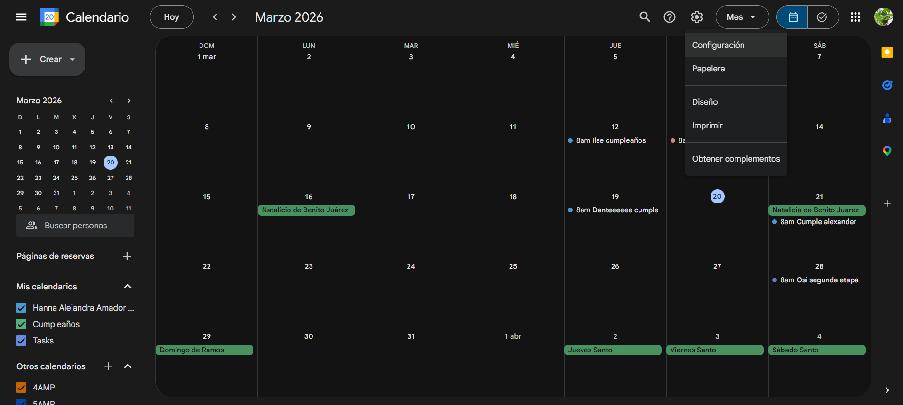

en el apartado de configuracion, eligo el calendario que quiero, y luego le doy al apartado donde dice Integrar calendario, aqui aparece un link 
con el calendario en el formato iCal que ocupaba

creo que el modulo de complementos es de mis favoritos
al parecer puedes elegir los cumplidos segun el momento del dia, segun la fecha y si lo integramos con el modulo de clima tambien se puede dependiendo del clima

`compliments: {
    "....-01-01": [
    "FELIZ AÑOO NUEVO WUJUU!"
    ],
    rain: [
    "Rainy days I'm thinkin' 'bout you"
    ]
  }`

tambien hay una opcion para que los tomara desde un repositorio remoto, pero como no encontre ninguno en español, decidi hacer uno

/workspaces/MagicMirror/src/compliments.json

## Sensores 
**Agregar sensor de proximidad**
https://github.com/paviro/MMM-PIR-Sensor
https://wokwi.com/projects/359631459962659841
Circuito 
Script
Modulo

**Agregar sensor de humedad y temperatura**
https://github.com/ryck/MMM-DHT-Sensor
https://wokwi.com/projects/357620843461800961
Cicuito 
Script 
Modulo

# Fase 3: Pagina web
Modulo que permite prender, apagar, reiniciar
https://github.com/Jopyth/MMM-Remote-Control 

metas
📱 Celular (web)
   ↓ WebSocket
🖥️ Servidor Node.js
   ↓ (notificación)
🪞 MagicMirror (módulo personalizado)

pasos
Tutorial de WebSocket (con Servidor Node.js)
Tutorial de módulos de MagicMirror

IDEAS 
# Fase X: Espejo de shrek
https://youtu.be/TWfRdWaov9s?si=9I-1MyFQDMZEY0m9
https://courses.media.mit.edu/2016spring/mass65/2016/05/14/the-magic-mirror/

# Fase X: Camara 
Para poder interactuar con el espejo como si fuera una interfaz

# Fase X: IoT

  

> Written with [StackEdit](https://stackedit.io/).