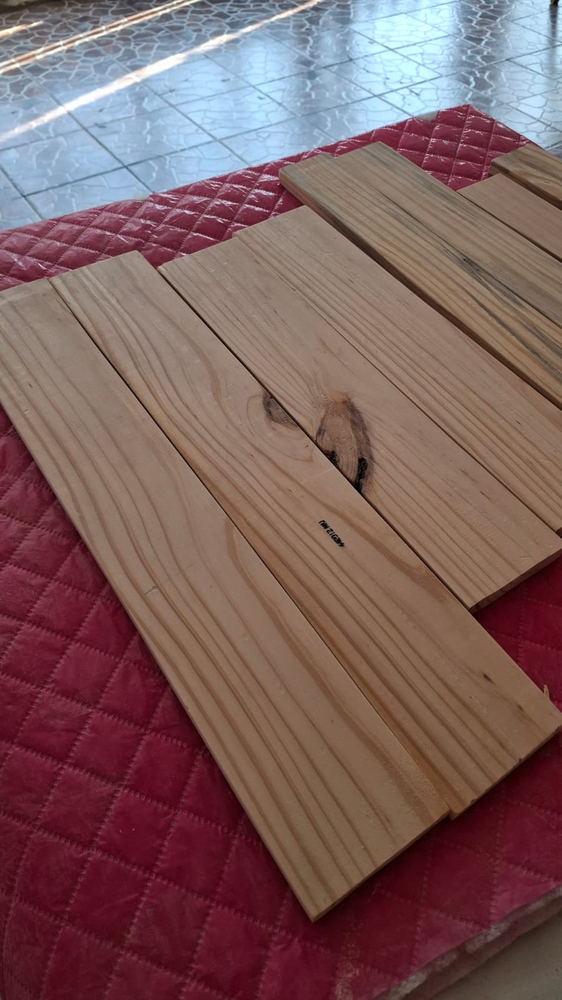
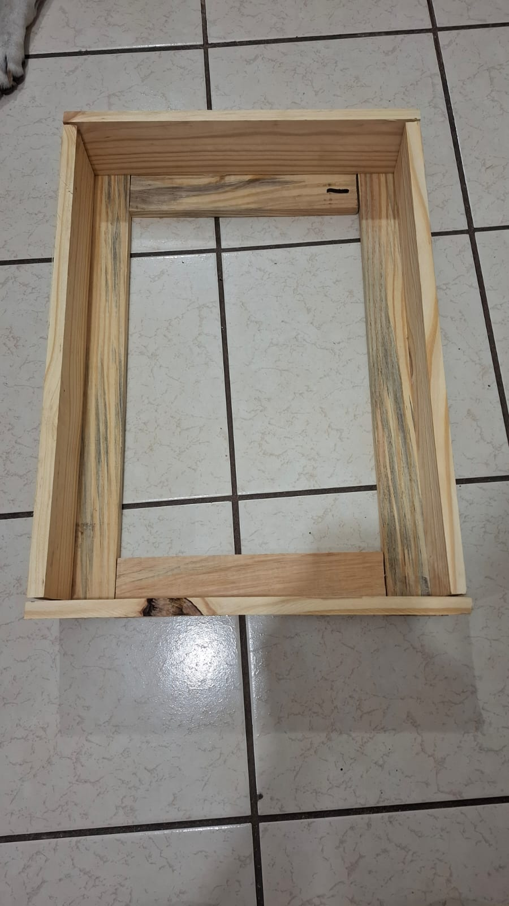
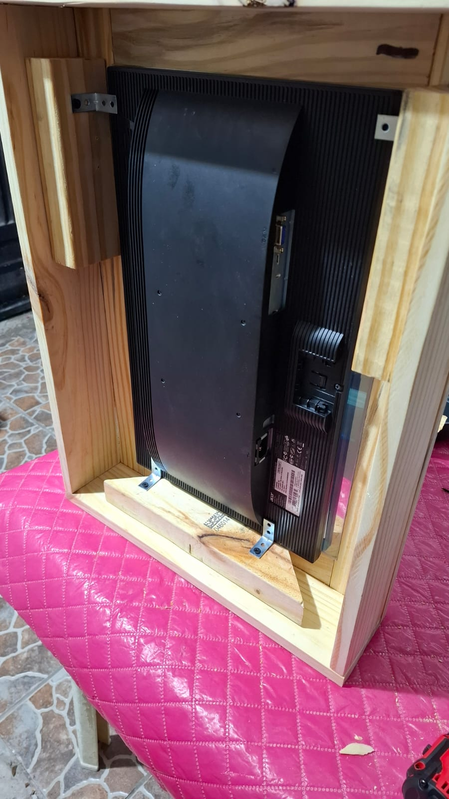
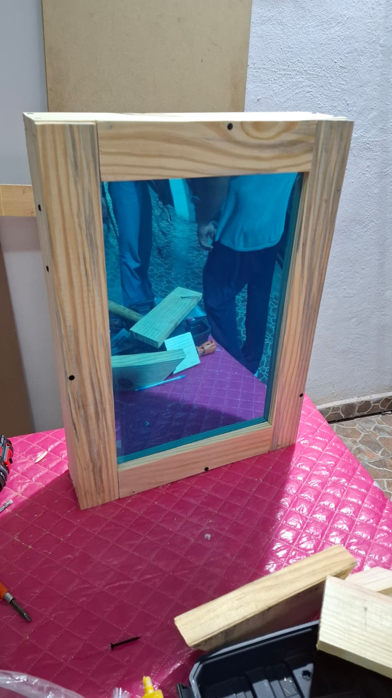
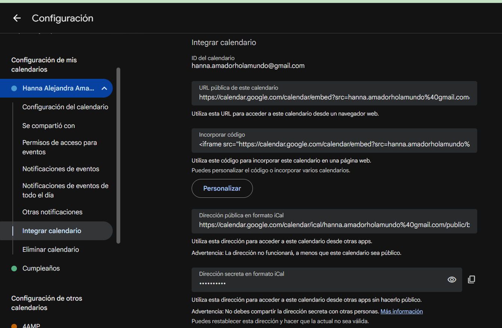
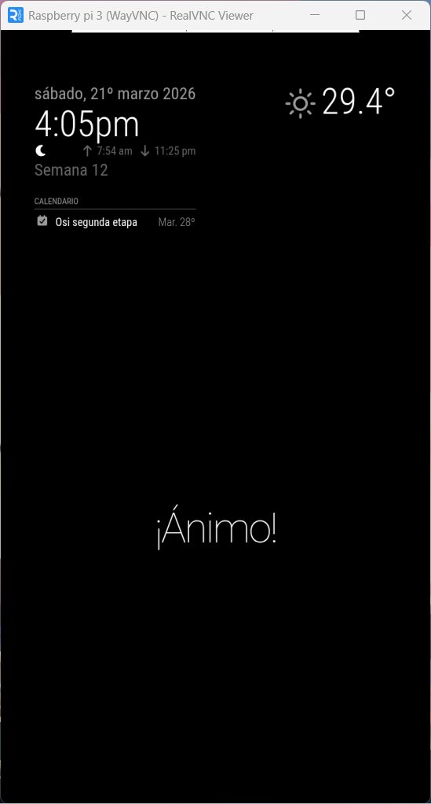

# **Magic Mirror**

  
# Contenido

**[Ensamblaje](#ensamblaje)**
  - [Materiales](#materiales)
  - [Corte y armado](#corte-y-armado)

**[Fase 1: Que funcione](#fase-1-que-funcione)**
  - [Distribución de Linux](#distribucion-de-linux)
  - [Instalación del sistema operativo](#instalacion-del-sistema-operativo)
  - [Instalación de Node.js](#instalacion-de-nodejs)
  - [Clonar repositorio](#clonar-repositorio)
  - [Primer arranque](#primer-arranque)
  - [Solución de errores](#solución-de-errores)

**[Fase 2: Configuración, módulos](#fase-2-configuracion-modulos-y-sensores)**
- [Configurar](#configurar)
  - [Orientación de pantalla](#orientacion-de-pantalla)
  - [Módulos existentes](#modulos-existentes)


# Ensamblaje

### Materiales
 
| Componente | Costo |
|---|---|
| Raspberry Pi 3B | $1,364 |
| Espejo bidireccional | $631 |
| Adaptador HDMI a VGA | $112 |
| Monitor | $100 |
| Madera de pino (1" x 3" x 2m y 1" x 4" x 2m) | $255 |
 
**Herramientas utilizadas:**
- Lijadora
- Taladro
- Sierra redonda eléctrica

### Corte y armado
 
Ya que conseguimos la madera, calculamos y marcamos los cortes necesarios. La madera de 3" se cortó en 2 piezas de 29.8 cm y 2 piezas de 57.3 cm para hacer el frente; la madera de 4" se cortó en 2 piezas de 42.6 cm y 2 piezas de 54.3 cm para los lados.
 

 
Después lijamos la madera y unimos las piezas con tornillos para formar el marco.


 
Añadimos soportes de madera en la parte trasera para sostener el espejo y el monitor. Pegamos el Raspberry Pi al monitor con cinta doble cara y conectamos todos los componentes. Como el monitor solo tiene entrada VGA y el Raspberry Pi solo tiene salida HDMI, fue necesario usar un adaptador.



Y asi se ve



# Fase 1: Que funcione

## Distribucion de linux

En proyectos anteriores había trabajado con Raspbian OS de 64 bits (Debian 12 Bookworm), pero el Raspberry Pi funcionaba lento, por lo que buscamos otras opciones:
 
- **DietPi**: Lo probé en una máquina virtual y resultó incompatible con la biblioteca Electron.
- **Raspberry Pi OS de 32 bits**: Igualmente incompatible con algunas bibliotecas de Node.js.
 
Por lo tanto, optamos por **Raspberry Pi OS de 64 bits**.

### Instalacion del sistema operativo

Para usarlo, lo primero que hice fue instalar Raspberry Pi Imager.

Seleccioné el modelo de mi Raspberry Pi, el sistema operativo, el microSD de almacenamiento, nombre del dispositivo, zona horaria, nombre de usuario, contraseña, red; me permitió activar el SSH, confirmé mis elecciones y empezó a escribir.


Puse la microSD en el Raspberry y esperé a que iniciara y terminara con las últimas configuraciones.

Configuré la conexión a internet.

Por último, habilité el VNC para poder controlarlo desde la laptop.


  

Instalé el RealVNC Viewer en la laptop y con la dirección IP del Raspberry me conecté, la cual se podía ver fácilmente al poner el mouse sobre el símbolo de internet de la Raspberry.

Busco actualizaciones

`sudo apt update`

`sudo apt upgrade -y`

## Descargar Magic Mirror

Para esto voy a seguir los pasos que dice la página oficial  
https://docs.magicmirror.builders/getting-started/installation.html

### Instalacion de Node.js

Dice que el primer paso es **descargar e instalar node.js**

Para eso sigo las instrucciones del repo de GitHub de node.js  
https://github.com/nodesource/distributions/blob/master/DEV_README.md#installation-instructions

Verificar que curl esté instalado  
`curl --version`

sí está instalado

Este comando *descarga un script que luego se usa para instalar Node.js (v22) desde el repositorio oficial de NodeSource.*

`curl -fsSL https://deb.nodesource.com/setup_22.x -o nodesource_setup.sh`

Node.js no es compatible con sistemas de 32 bits, por eso fue necesario usar Raspberry Pi OS de 64 bits.


Tuve que hacer todo desde el inicio.

Ejecutar el script de configuración:  
`sudo bash nodesource_setup.sh`

Instalar Node.js:  
`sudo apt install -y nodejs`

Verificar la instalación:  
`node -v`

### Clonar repositorio

El siguiente paso es ver si está instalado **git**

Para ver si está instalado solo escribo  
`git`

sí está instalado

El siguiente paso sería clonar el repositorio del Magic Mirror:  
`git clone https://github.com/MagicMirrorOrg/MagicMirror.git`

Entro al repositorio  
`cd MagicMirror`

Instalo la aplicación  
`node --run install-mm`


Inicio la aplicación  
`node --run start`


Salieron muchos errores, corro eso para que se instale todo al 100


Lo vuelvo a intentar correr a ver si está todo bien  
`node --run start`

pero me da un error


Me había saltado un paso, copio el archivo de configuración  
`cp config/config.js.sample config/config.js`

Ahora sí lo corro  
`node --run start`

Y ya funcionó


# Fase 2: Configuracion, módulos y sensores

## Configurar

#### Orientación de pantalla
Para cambiar la orientación de la pantalla en Raspberry Pi voy a Menú > Preferences > Control Center.  
Ingreso la contraseña.

Y voy al apartado de screens.


Selecciono left


#### Configuración general

Navego al directorio de configuración:  
`cd /MagicMirror/config/`

Abro el archivo de config.js en Thonny para modificarlo más fácil, al final copié todo y lo modifiqué en mi lap y ya después nomás lo pegué en Thonny porque era más fácil.


De la configuración general, solo cambié el idioma y el timeFormat  
`language: "spa"`  
`timeFormat: 12`

### Autostart


## Módulos

### Configurar módulos existentes 

Para esto seguí editando el archivo de config.js.  
Ahora en la parte de modules, cambié algunas configuraciones para ver qué hacían:  
https://docs.magicmirror.builders/modules/configuration.html  
Toda la info está en esta página.

**Alert**
Configuramos este modulo para que cada que vez que se inicie el magic mirror muestre un mensaje que diga "Hola bb".

**Update notification**
Mostrará un mensaje cada vez que haya una nueva versión de la aplicación MagicMirror disponible.

**Clock**
Este modulo es el que se encarga de mostrar el reloj, ademas 

**Calendario**
Cuando llegué a la parte del calendario, quería que se viera mi calendario, no el gringo que estaba ahí. En el mismo documento decía que podía poner cualquier calendario en iCal, entonces fui a mi calendario de Google.


En el apartado de configuración, elijo el calendario que quiero y luego le doy al apartado donde dice Integrar calendario; aquí aparece un link con el calendario en el formato iCal que ocupaba. Primero copié el link que dice dirección pública en formato iCal y no funcionaba, decía que no lo encontraba. Entonces copié el que sí era, el que dice dirección secreta en formato iCal, y ya funcionó.




**Complementos**
Creo que el módulo de complementos es de mis favoritos.  
Puedes elegir los cumplidos según el momento del día, según la fecha y, si lo integramos con el módulo de clima, también se puede dependiendo del clima.


`compliments: {
    "....-03-20": [
        "funciono!"
    ]
  }`

También hay una opción para que los tomara desde un repositorio remoto, pero como no encontré ninguno en español, decidí hacer uno.

Subí a mi github un achivo que se llama compliments.json

```
{
  "morning": [
    "Slay",
    "Loba loba",
    "A los culos no les hacen corridos",
    "Mereces todo lo bueno que la vida te ofrece",
    "Echale ganas"
  ],
  "afternoon": [
    "¡Ánimo!",
    "Eres suficiente, exactamente tal y como eres hoy",
    "tú misma brillas",
    "DIVA",
    "Tienes que confiar porque si no confias, no hay confianza."
  ],
  "evening": [
    "Descansa",
    "A mimir",
    "DUERMETE",
    "lowkey"
  ],
  "....-01-01": [
    "¡FELIZ AÑO NUEVO!"
  ],
  "....-12-24": [
    "¡Feliz Nochebuena!"
  ],
  "....-12-25": [
    "¡FELIZ NAVIDAAAD!",
    "HOHOHO"
  ],
  "....-12-31": [
    "Feliz noche vieja.",
    "Ve sacando las maletas.",
    "Pasado pisado."
  ]
}
```

Aquí puse los cumplidos que quería que dijera, es muy importante copiar la dirección como *raw code*; primero copié la dirección normal del archivo y no funcionó.

`remoteFile: 'https://raw.githubusercontent.com/Hannaaa47/MagicMirror/refs/heads/main/src/compliments.json',`


Ya así se ve por ahora el Magic Mirror



